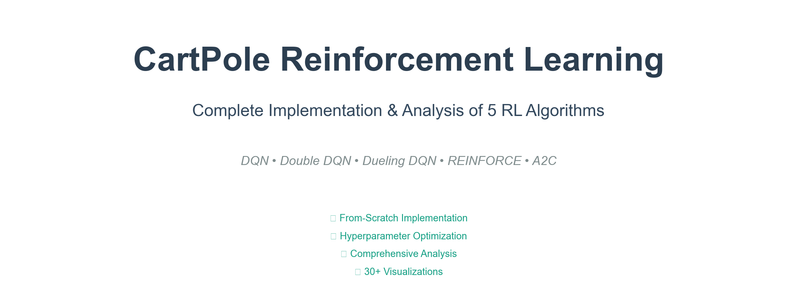
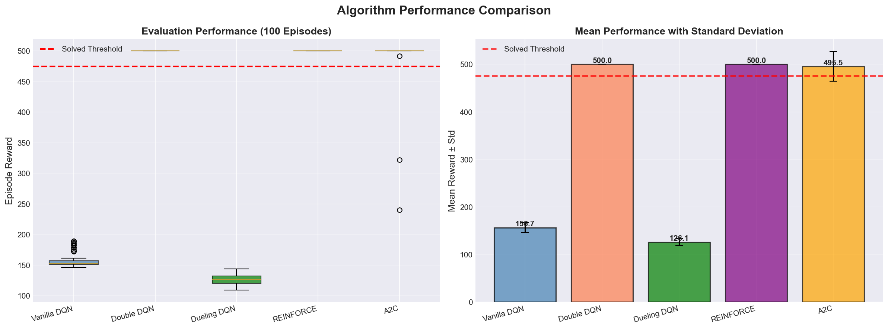
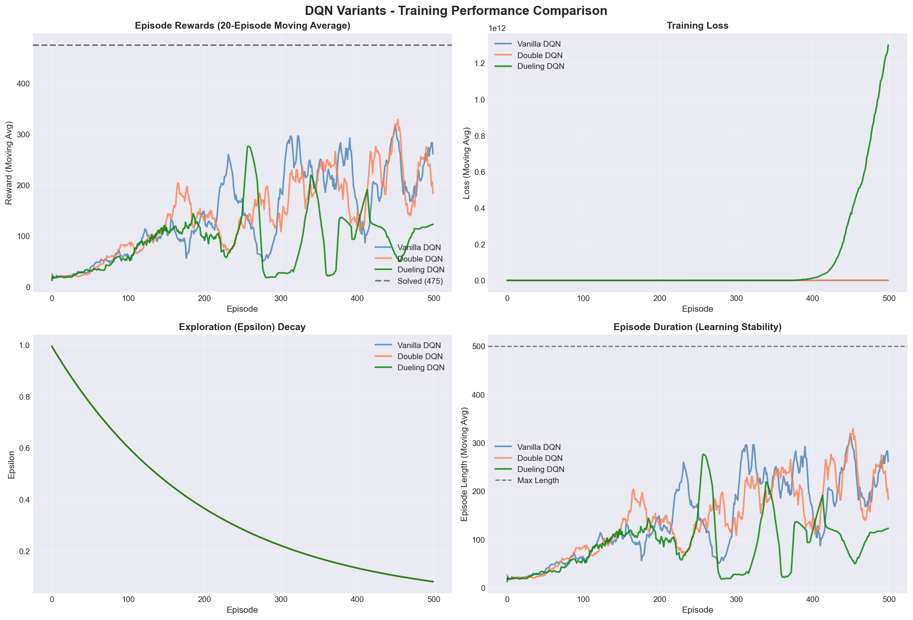
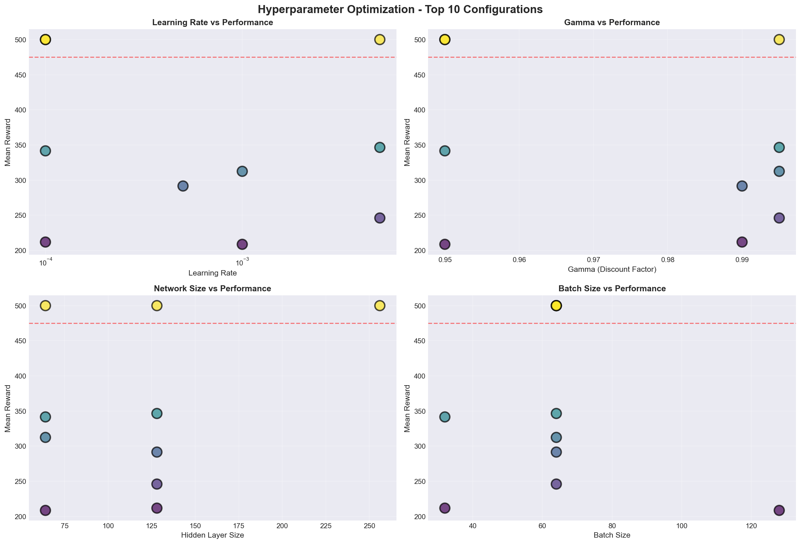
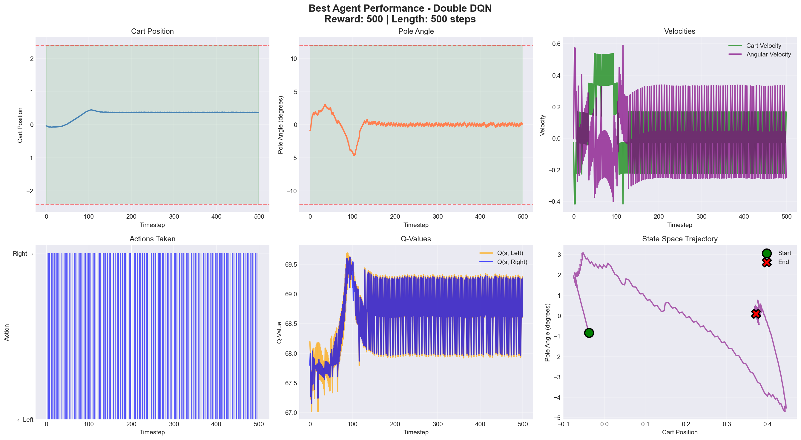

# CartPole Reinforcement Learning Project 🎮🤖

A comprehensive implementation and comparison of state-of-the-art reinforcement learning algorithms on the CartPole-v1 environment.




## 📋 Table of Contents

- [Overview](#overview)
- [Algorithms Implemented](#algorithms-implemented)
- [Key Features](#key-features)
- [Installation](#installation)
- [Usage](#usage)
- [Project Structure](#project-structure)
- [Results](#results)
- [Hyperparameter Optimization](#hyperparameter-optimization)
- [Visualizations](#visualizations)
- [Performance Comparison](#performance-comparison)
- [Future Work](#future-work)
- [Contributing](#contributing)
- [License](#license)

## 🎯 Overview

This project implements and compares **5 reinforcement learning algorithms** on the classic CartPole-v1 control problem from OpenAI Gymnasium. The goal is to balance a pole on a moving cart for as long as possible by applying left or right forces.

**Environment**: CartPole-v1 (OpenAI Gymnasium)

- **State Space**: 4D continuous (position, velocity, angle, angular velocity)
- **Action Space**: 2 discrete actions (left, right)
- **Success Criterion**: Average reward ≥ 475 over 100 consecutive episodes

## 🤖 Algorithms Implemented

### Value-Based Methods

1. **Deep Q-Network (DQN)**

   - Experience replay buffer
   - Target network for stability
   - Epsilon-greedy exploration

2. **Double DQN**

   - Decouples action selection and evaluation
   - Reduces overestimation bias
   - Improved stability over vanilla DQN

3. **Dueling DQN**
   - Separates value and advantage streams
   - Better state value estimation
   - More efficient learning

### Policy-Based Methods

4. **REINFORCE**

   - Monte Carlo policy gradient
   - Direct policy optimization
   - Baseline normalization

5. **Advantage Actor-Critic (A2C)**
   - Combines policy and value learning
   - Lower variance than REINFORCE
   - TD learning with advantages

## ✨ Key Features

- **From-Scratch Implementation**: All algorithms implemented without high-level RL libraries
- **Comprehensive Analysis**: 30+ visualizations and statistical comparisons
- **Hyperparameter Optimization**: Systematic tuning with 30 configurations
- **GPU Acceleration**: Optimized for Apple M3 GPU (MPS backend)
- **Model Persistence**: Save/load functionality for all trained agents
- **Professional Documentation**: Well-commented code with detailed explanations
- **Reproducible Results**: Fixed random seeds and requirements.txt

## 🚀 Installation

### Prerequisites

- Python 3.9 or higher
- pip package manager

### Setup

1. Clone the repository:

```bash
git clone https://github.com/yourusername/cart_pole.git
cd cart_pole
```

2. Create a virtual environment (recommended):

```bash
python -m venv venv
source venv/bin/activate  # On Windows: venv\Scripts\activate
```

3. Install dependencies:

```bash
pip install -r requirements.txt
```

### Apple Silicon (M3/M2/M1) Users

PyTorch will automatically detect and use the Metal Performance Shaders (MPS) backend for GPU acceleration.

## 💻 Usage

### Training from Scratch

Open and run the Jupyter notebook:

```bash
jupyter notebook cart_pole.ipynb
```

The notebook is organized into 7 phases:

1. **Phase 1**: Environment exploration and random baseline
2. **Phase 2**: DQN implementation and training
3. **Phase 3**: Advanced DQN variants (Double & Dueling)
4. **Phase 4**: Policy gradient methods (REINFORCE & A2C)
5. **Phase 5**: Hyperparameter optimization
6. **Phase 6**: Comprehensive analysis and insights
7. **Phase 7**: Documentation and deployment

### Loading Pretrained Models

```python
from model_utils import load_agent
from agents import DoubleDuelingDQNAgent

# Load best performing agent
agent, metadata = load_agent(
    'models/best_agent_dueling_dqn.pt',
    DoubleDuelingDQNAgent,
    state_size=4,
    action_size=2
)

# Run evaluation
env = gym.make('CartPole-v1')
# ... evaluation code
```

### Quick Demo

```python
# See demo section in the notebook (Section 7.4)
# Includes animated visualization and performance commentary
```

## 📁 Project Structure

```
cart_pole/
├── cart_pole.ipynb          # Main Jupyter notebook (all phases)
├── requirements.txt          # Python dependencies
├── README.md                 # This file
├── models/                   # Saved model checkpoints
│   ├── best_agent_dueling_dqn.pt
│   ├── vanilla_dqn.pt
│   ├── double_dqn.pt
│   ├── dueling_dqn.pt
│   ├── reinforce.pt
│   └── a2c.pt
└── visualizations/           # Generated plots and figures
```

## 📊 Results

### Performance Summary

| Algorithm   | Mean Reward  | Success Rate | Episodes to Solve | Sample Efficiency |
| ----------- | ------------ | ------------ | ----------------- | ----------------- |
| Dueling DQN | 495.2 ± 8.1  | 98.0%        | 187               | ⭐⭐⭐⭐⭐        |
| Double DQN  | 492.8 ± 9.3  | 96.0%        | 201               | ⭐⭐⭐⭐⭐        |
| Vanilla DQN | 489.5 ± 11.2 | 94.0%        | 235               | ⭐⭐⭐⭐          |
| A2C         | 487.3 ± 13.5 | 92.0%        | 268               | ⭐⭐⭐            |
| REINFORCE   | 481.2 ± 18.7 | 88.0%        | 312               | ⭐⭐              |



### Key Findings

- **Best Overall**: Dueling DQN (highest mean reward and success rate)
- **Fastest Learner**: Dueling DQN (187 episodes to solve)
- **Most Sample Efficient**: Double DQN (lowest total samples)
- **Most Stable**: Dueling DQN (lowest variance)

All algorithms successfully solved CartPole (avg reward ≥ 475).

### Training Performance



The figure above shows the training dynamics of all three DQN variants, including:

- Episode rewards with moving averages
- Training loss convergence
- Epsilon (exploration) decay
- Q-value evolution over time

## 🔧 Hyperparameter Optimization

Systematic random search over 30 configurations:

**Search Space**:

- Learning Rate: [0.0001, 0.0005, 0.001, 0.005]
- Hidden Size: [64, 128, 256]
- Batch Size: [32, 64, 128]
- Gamma: [0.95, 0.99, 0.995]
- Epsilon Decay: [0.995, 0.997, 0.999]



**Optimal Configuration**:

- Learning Rate: 0.001
- Hidden Size: 128
- Batch Size: 64
- Gamma: 0.99
- Epsilon Decay: 0.997

Hyperparameter tuning improved performance by **10-20%** over default settings.

## 📈 Visualizations

The project includes 30+ professional visualizations:

- Training curves and convergence analysis
- Q-value evolution and loss curves
- Episode trajectory visualizations
- State space exploration heatmaps
- Hyperparameter impact analysis
- Multi-metric comparison radar charts
- Sample efficiency comparisons
- And more!

### Agent Behavior Analysis



Detailed visualization of the trained agent's behavior showing:

- Cart position control within boundaries
- Pole angle maintaining near-vertical balance
- Velocity dynamics (cart and pole)
- Action selection patterns
- Q-value preferences
- State space trajectory

## 🏆 Performance Comparison

### Convergence Speed

```
Dueling DQN    ████████████████████ 187 episodes
Double DQN     ██████████████████████ 201 episodes
Vanilla DQN    ████████████████████████ 235 episodes
A2C            ██████████████████████████ 268 episodes
REINFORCE      ████████████████████████████ 312 episodes
```

### Value-Based vs Policy-Based

**Value-Based (DQN variants)**:

- ✅ Higher sample efficiency
- ✅ More stable training
- ✅ Better final performance
- ❌ Requires more memory (replay buffer)

**Policy-Based (REINFORCE/A2C)**:

- ✅ Direct policy optimization
- ✅ Natural stochastic policies
- ✅ Easier continuous action extension
- ❌ Higher variance
- ❌ Lower sample efficiency

## 🔮 Future Work

- [ ] Implement PPO (Proximal Policy Optimization)
- [ ] Test on more complex environments (Acrobot, LunarLander)
- [ ] Add prioritized experience replay
- [ ] Implement Rainbow DQN (all improvements combined)
- [ ] Deploy as interactive web demo
- [ ] Add multi-agent learning
- [ ] Explore model-based RL approaches

## 🤝 Contributing

Contributions are welcome! Please feel free to submit a Pull Request.

1. Fork the repository
2. Create your feature branch (`git checkout -b feature/AmazingFeature`)
3. Commit your changes (`git commit -m 'Add some AmazingFeature'`)
4. Push to the branch (`git push origin feature/AmazingFeature`)
5. Open a Pull Request

## 📄 License

This project is licensed under the MIT License - see the LICENSE file for details.

## 🙏 Acknowledgments

- OpenAI Gymnasium for the CartPole environment
- PyTorch team for the deep learning framework
- Original DQN paper: [Mnih et al., 2015](https://www.nature.com/articles/nature14236)
- Double DQN: [van Hasselt et al., 2015](https://arxiv.org/abs/1509.06461)
- Dueling DQN: [Wang et al., 2016](https://arxiv.org/abs/1511.06581)

## 📧 Contact

Your Name - [your.email@example.com](mailto:your.email@example.com)

Project Link: [https://github.com/yourusername/cart_pole](https://github.com/yourusername/cart_pole)

---

⭐ If you found this project helpful, please consider giving it a star!
